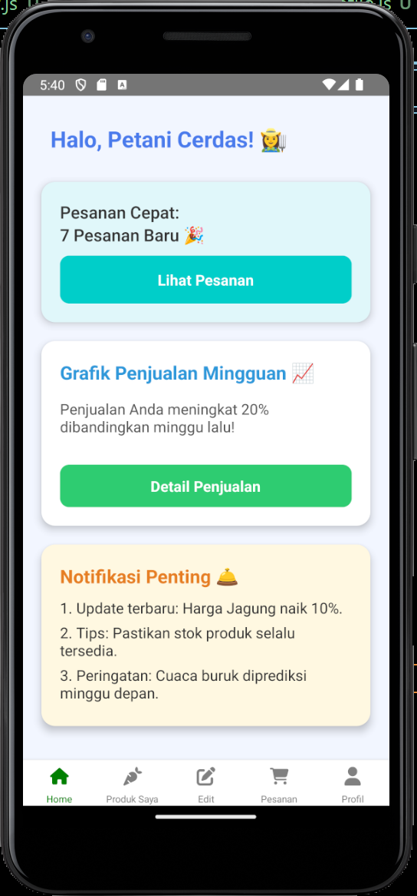
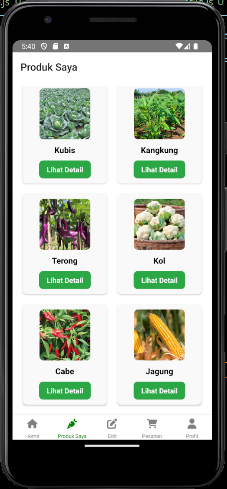
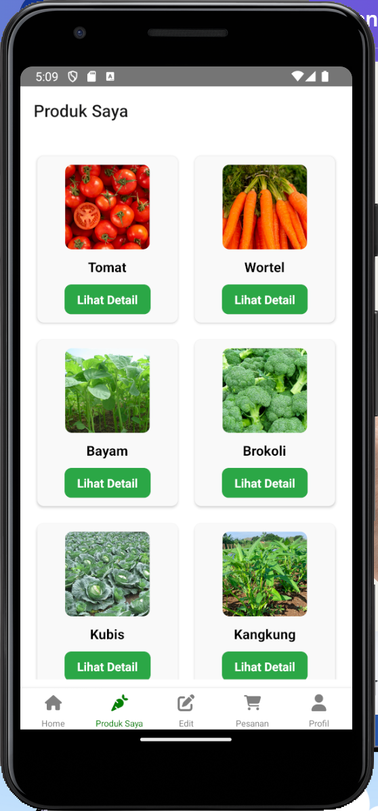
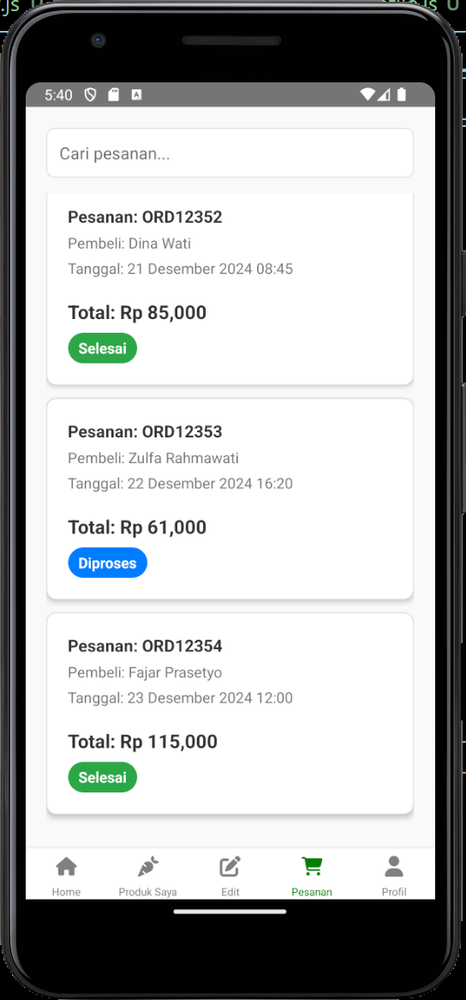
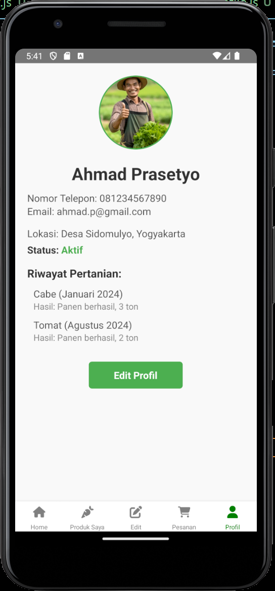
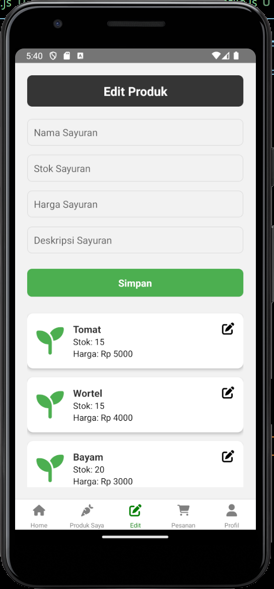

# Lokatani - Digital Agricultural Marketplace
---

---

## 1. Latar Belakang

Lokatani adalah platform digital yang bertujuan untuk mempermudah transaksi jual beli produk pertanian antara petani dan konsumen. Di Indonesia, petani seringkali kesulitan untuk mendapatkan akses pasar yang lebih luas, dan para konsumen kesulitan dalam mendapatkan produk pertanian yang segar dan berkualitas. Lokatani hadir untuk mengatasi permasalahan ini dengan menyediakan sebuah marketplace yang menghubungkan petani langsung dengan konsumen, pengecer, dan grosir. Dengan demikian, proses distribusi dapat lebih efisien, harga lebih transparan, dan keuntungan lebih adil bagi petani.

## 2. Tujuan Produk Dibuat

Produk ini dibuat dengan tujuan untuk:
- **Mempermudah akses pasar bagi petani**: Lokatani memberikan platform untuk petani dapat menjual produk mereka langsung kepada konsumen atau pengecer tanpa perantara.
- **Meningkatkan kesejahteraan petani**: Dengan memberikan harga yang lebih adil dan akses yang lebih luas ke pasar, petani dapat meningkatkan pendapatan mereka.
- **Menciptakan ekosistem pertanian yang lebih efisien dan transparan**: Platform ini berfokus pada pengurangan perantara dalam rantai pasok pertanian dan memberikan transparansi harga yang lebih baik bagi semua pihak.
- **Memberikan kemudahan bagi konsumen**: Mempermudah konsumen dalam membeli produk pertanian yang segar dengan harga yang kompetitif.

## 3. Komponen yang Digunakan

Berikut adalah komponen utama yang digunakan dalam pengembangan Lokatani:
  - React Native: Untuk membangun aplikasi mobile yang dapat berjalan di platform Android dan iOS.
  - FontAwesome: Untuk mengambil ikon
  - React Navigation: Untuk menangani navigasi antar halaman dalam aplikasi.

- **Sumber Data**:
  - Data produk pertanian yang diinput oleh petani.
  - Data transaksi yang dilakukan antara petani dan konsumen melalui platform.
  - Data pengguna (petani, pembeli, pengecer) yang terdaftar dalam sistem.
  
## 4. Sumber Data

Lokatani mengumpulkan data dari beberapa sumber utama, antara lain:
- **Data pengguna**: Pengguna yang mendaftar di platform (petani, pembeli, pengecer) memberikan data mereka untuk mempermudah transaksi.
- **Data produk**: Petani mengunggah informasi produk yang akan dijual, termasuk deskripsi, harga, jumlah stok, dan lokasi.
- **Data transaksi**: Setiap transaksi yang terjadi antara petani dan pembeli dicatat dalam sistem untuk keperluan laporan dan analisis.

## 5. Pembahasan Overview Produk Setiap Halamannya

### 5.1 Halaman Beranda (Home Page)

Halaman beranda merupakan tampilan utama aplikasi yang memberikan informasi secara ringkas tentang aktivitas terbaru di Lokatani. Di sini, pengguna dapat melihat:
- Ringkasan pesanan terbaru.
- Grafik penjualan untuk memantau performa produk.
- Notifikasi terbaru tentang perubahan harga atau tips penting bagi petani.
- Akses cepat ke fitur jual beli produk.

### 5.2 Halaman Produk

  
  

Halaman ini memungkinkan petani untuk menambahkan, mengedit, atau menghapus produk mereka yang ingin dijual. Pengguna dapat melihat:
- Daftar produk yang telah diunggah.
- Fitur pencarian dan filter produk berdasarkan kategori atau harga.
- Informasi detail produk seperti deskripsi, harga, dan jumlah stok.

### 5.3 Halaman Pesanan

Halaman pesanan memungkinkan pengguna untuk memonitor dan mengelola pesanan yang telah dilakukan atau diterima. Pengguna dapat:
- Melihat status pesanan terbaru.
- Melihat detail pesanan dan status pengiriman.
- Melakukan pembatalan atau perubahan pesanan jika diperlukan.

### 5.4 Halaman Profil

Di halaman profil, pengguna dapat melihat dan mengelola informasi pribadi mereka. Ini termasuk:
- Data pribadi seperti nama, alamat, dan informasi kontak.
- Riwayat transaksi dan penjualan.
- Pengaturan preferensi notifikasi dan akun.

### 5.5 Halaman Edit Stok Produk

Halaman ini menampilkan berbagai notifikasi penting bagi pengguna, seperti:
- Update tentang perubahan harga.
- Update tentang perubahan stok.

---

